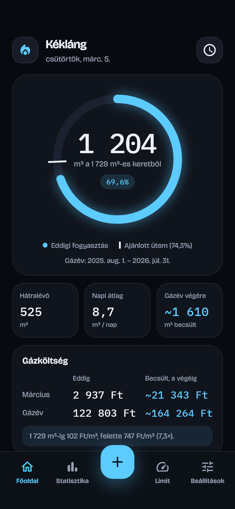
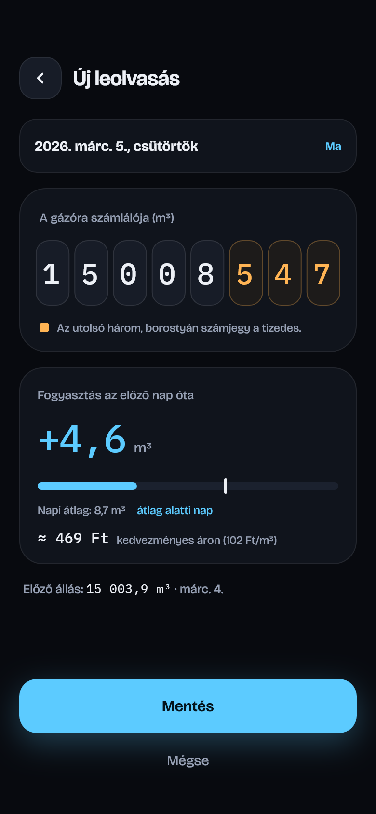
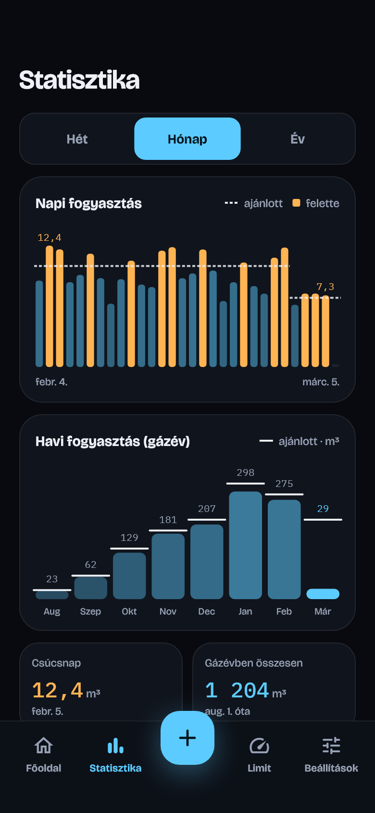
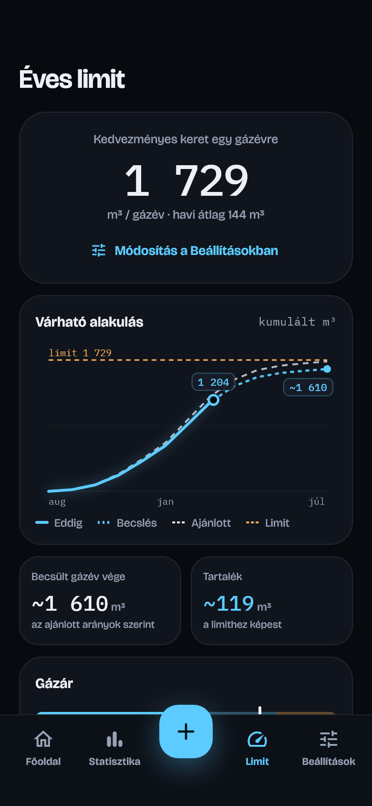
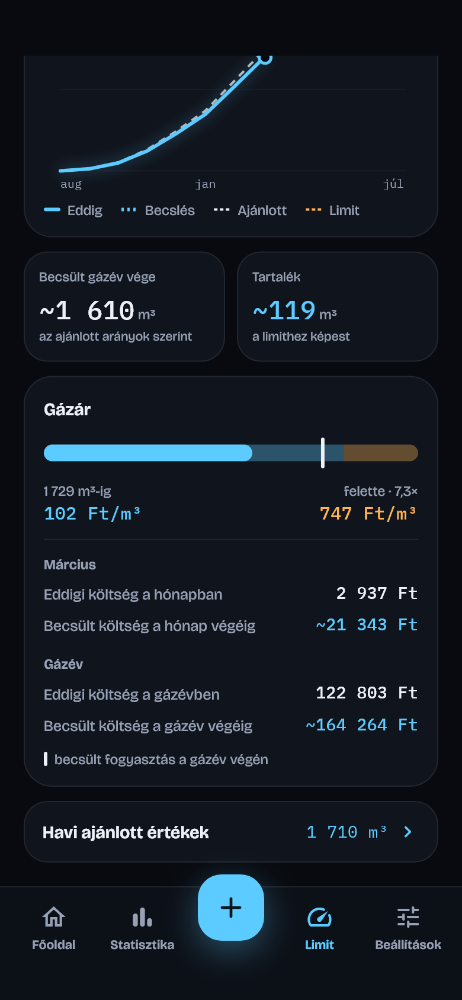
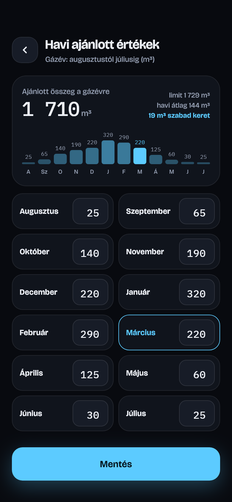
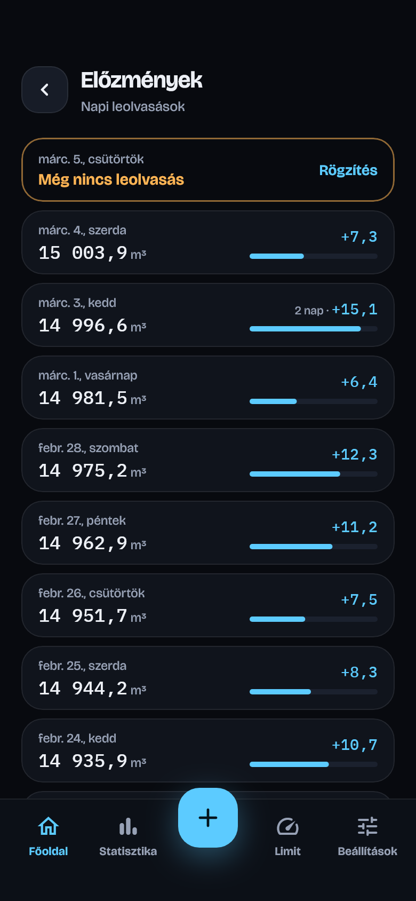
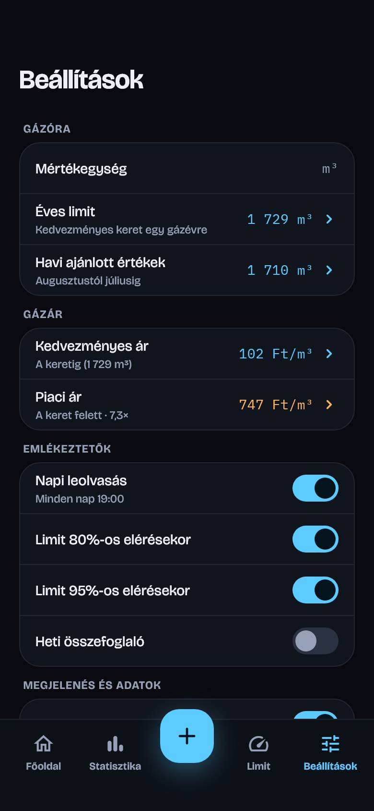

<p align="center">
  
</p>

<h1 align="center">Kékláng</h1>

<p align="center">
  <b>Gázfogyasztás-követő Androidra</b><br>
  Napi gázóra-leolvasás, kedvezményes keret, gázköltség és gázév végi becslés, egy helyen.
</p>

<p align="center">
  
</p>

## Mire jó?

A rezsicsökkentett gáz egy gázévben **1 729 m³-ig** kedvezményes áron (**102 Ft/m³**)
fogy, felette viszont piaci áron (**747 Ft/m³**), ami kb. hétszeres drágulás. A gázév
**augusztus 1-jétől a következő év július 31-ig** tart. Ezért fontos tudni, hogy
**jó ütemben fogy-e a gáz**. A Kékláng ehhez minden nap egy gyors leolvasást kér, és
ebből kiszámolja:

- **mennyi fogyott a gázévben**, és ez a kedvezményes keret hány százaléka;
- **hol kellene tartanod** a havi ajánlott értékek alapján (ajánlott ütem);
- **mennyi lesz a gázév végére** a mostani tempóval, és belefér-e a keretbe;
- **mennyibe kerül**: eddigi és becsült gázköltség, és ha a becslés túllépi a keretet,
  mekkora többletköltséggel jár;
- **mely napokon és hónapokban** fogyott több az ajánlottnál.

Minden adat a telefonon marad, nincs regisztráció és nincs szerver.

## Képernyők

<table>
  <tr>
    <td align="center"><br><b>Főoldal</b><br><sub>Kedvezményes keret, ajánlott ütem, gázköltség</sub></td>
    <td align="center"><br><b>Állás rögzítése</b><br><sub>Számjegyenkénti bevitel, fogyasztás és ára</sub></td>
    <td align="center"><br><b>Statisztika</b><br><sub>Napi és havi bontás, ajánlott szinttel</sub></td>
  </tr>
  <tr>
    <td align="center"><br><b>Éves limit</b><br><sub>Keret, várható alakulás a gázévben</sub></td>
    <td align="center"><br><b>Gázár</b><br><sub>Árlépcső, eddigi és becsült költség</sub></td>
    <td align="center"><br><b>Havi ajánlott értékek</b><br><sub>Augusztustól júliusig, szerkeszthető</sub></td>
  </tr>
  <tr>
    <td align="center"><br><b>Előzmények</b><br><sub>Leolvasások szerkesztése és törlése</sub></td>
    <td align="center"><br><b>Beállítások</b><br><sub>Keret, havi értékek, gázár, emlékeztetők</sub></td>
    <td></td>
  </tr>
</table>

<sub>A képek mintaadatokkal készültek (lásd lent: <a href="#képernyőképek-újragenerálása">Képernyőképek újragenerálása</a>).</sub>

## Funkciók

- **Gyors rögzítés:** 8 számjegyes mező (5 egész és 3 tizedes), az előző állással
  előtöltve, így általában elég az utolsó számjegyeket átírni. A dátum utólag is választható,
  és nem menthető az előzőnél kisebb állás.
- **Kihagyott napok kezelése:** ha egy-két nap kimarad, a két leolvasás közti fogyasztás
  egyenletesen oszlik el a köztes napokra.
- **Diagramok értékekkel:** oszlopdiagramok a napi, heti és havi fogyasztásról, a köbméter-értékek
  az oszlopok fölött. Borostyánszínű jelöli, ahol a fogyasztás az ajánlott fölött van.
- **Gázév (augusztus 1. – július 31.):** minden éves érték, diagram és becslés a gázévre
  vonatkozik, a havi értékek augusztustól júliusig sorakoznak.
- **Gázév végi becslés:** az eddigi fogyasztás és a hátralévő hónapok ajánlott értékei
  alapján, a tényleges tempóhoz igazítva.
- **Gázköltség kétsávos árral:** a keretig kedvezményes, felette piaci áron. A Főoldal mutatja
  az aktuális hónap és a gázév eddigi és becsült költségét, és figyelmeztet, ha a becslés
  túllépi a keretet. A Limit képernyő szemlélteti az árlépcsőt, a Rögzítés pedig a mért
  mennyiség árát. Mindkét ár a Beállításokban módosítható (alapból 102 és 747 Ft/m³).
- **Minden beállítás egy helyen:** a kedvezményes keret (alapból 1 729 m³, havi átlag 144 m³),
  a 12 havi ajánlott érték és a két gázár a Beállításokban módosítható. A Limit képernyő csak
  megjeleníti a keretet. Az ajánlott értékek alapösszege 1 710 m³.
- **Sötét téma, magyar felület**, saját betűtípusokkal (Bricolage Grotesque és IBM Plex Mono),
  kikapcsolható animációkkal.

**Tervezett:** értesítések (napi emlékeztető, figyelmeztetés a limit 80 és 95%-ánál, heti
összefoglaló) és CSV-export. A beállítások már mentődnek, de értesítést az app még nem küld.

## Hogyan számol?

| Érték | Számítás |
| --- | --- |
| Napi fogyasztás | Két leolvasás különbsége, egyenletesen elosztva a köztes napokra |
| Gázévben összesen | A napi fogyasztások összege a gázév elejétől (augusztus 1.) |
| Ajánlott ütem | A havi ajánlott értékek összege augusztus 1-jétől máig (az aktuális hónap arányos részével), a keret százalékában |
| Gázév végi becslés | Eddigi fogyasztás + a július 31-ig hátralévő ajánlott mennyiség × (tényleges ÷ ajánlott fogyasztás a követett időszakban) |
| Költség | A gázév elejétől a keretig kedvezményes ár, a keret felett piaci ár; pl. 1 829 m³ = 1 729 × 102 + 100 × 747 Ft |
| Többletköltség | A becsült kereten felüli mennyiség × (piaci ár − kedvezményes ár) |
| Napi átlag | Az utolsó 7 nap átlaga, csak azokra a napokra, amelyekre van adat |

A keret éves: a havi 144 m³ csak tájékoztató átlag (1 729 / 12), a költséget az app a
gázév elejétől összesített fogyasztásból számolja.

Ha a gázév közben kezded használni, a korábbi hónapok fogyasztását az app nem ismeri, ezért a
„gázévben összesen”, a költség és a becslés is alacsonyabb lesz a valóságosnál.

## Technológia

| | |
| --- | --- |
| Keretrendszer | [Flutter](https://flutter.dev) (Dart), Android |
| Adattárolás | [drift](https://drift.simonbinder.eu) (SQLite), csak a telefonon |
| Állapotkezelés | [Riverpod](https://riverpod.dev) |
| Navigáció | [go_router](https://pub.dev/packages/go_router) |
| Diagramok | saját `CustomPainter` és widget alapú rajzolás |

## Projekt felépítése

| Mappa | Tartalom |
| --- | --- |
| `lib/core/` | téma (színek, betűk), magyar szám- és dátumformázás |
| `lib/domain/` | tiszta Dart üzleti logika: `ConsumptionModel` (gázév, napi bontás, ajánlott ütem, becslés, költség), `GasPricing` (kétsávos ár) |
| `lib/data/` | drift adatbázis és repository |
| `lib/providers.dart` | Riverpod providerek |
| `lib/router.dart` | útvonalak, alsó navigáció (`StatefulShellRoute`) |
| `lib/ui/` | képernyők, közös widgetek, diagramok |
| `test/` | unit tesztek (számítások, diagramfeliratok) és a képernyőket végigjáró widget-teszt |
| `tool/` | ikon- és képernyőkép-generáló szkriptek |
| `docs/` | útmutatók |

## Fejlesztés

```bat
flutter pub get
dart run build_runner build
flutter analyze
flutter test
flutter run
```

A `build_runner` a drift adatbázis kódját generálja (`lib/data/database.g.dart`). Csak akkor
kell újra futtatni, ha a `lib/data/database.dart` változik.

### Útmutatók

- [Futtatás telefonon (USB)](docs/futtatas-telefonon.md): a telefon csatlakoztatása,
  `flutter run`, hibaelhárítás
- [Release aláírás és telepítés](docs/release-alairas.md): aláíró kulcs, verziózás, új verzió
  kiadása, telepítés adatvesztés nélkül

> **Telepítéshez ne használd a `flutter install` parancsot!** Telepítés előtt törli az
> appot, és vele az összes rögzített adatot. Helyette:
> `adb install -r build\app\outputs\flutter-apk\app-release.apk`

### Ikon újragenerálása

Az ikont a [tool/generate_icon_test.dart](tool/generate_icon_test.dart) rajzolja meg (a dizájn
lángja kék színátmenettel). Változtatás után:

```bat
flutter test tool/generate_icon_test.dart
dart run flutter_launcher_icons
```

### Képernyőképek újragenerálása

A README képeit a [tool/screenshots_test.dart](tool/screenshots_test.dart) készíti
mintaadatokkal (a 2025/26-os gázév leolvasásai, „ma” = 2026. márc. 5.), a valódi betűtípusokkal:

```bat
flutter test tool/screenshots_test.dart
```

Az eredmény a `docs/screenshots/` mappába kerül.

## Dizájn

A felület egy Claude-dal készült dizájnterv alapján készült.
