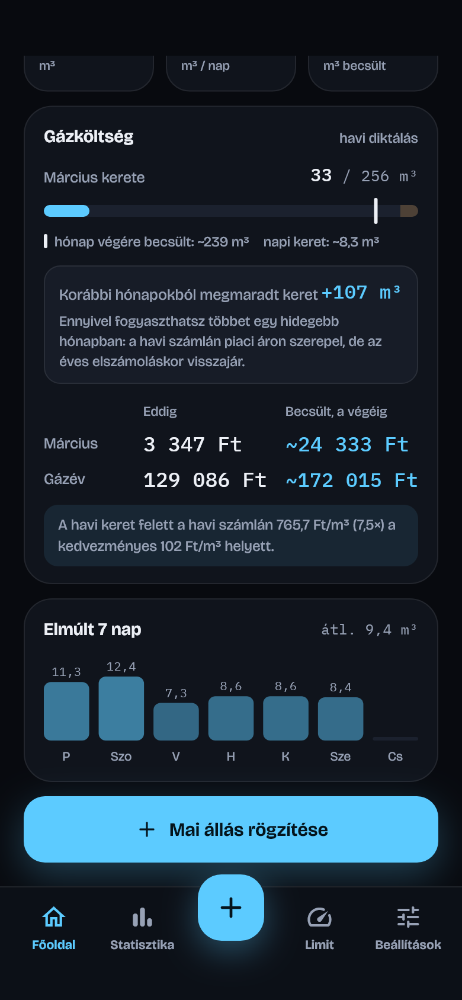

<p align="center">
  
</p>

<h1 align="center">Kékláng</h1>

<p align="center">
  <b>Gázfogyasztás-követő alkalmazás Androidra</b><br>
</p>

<p align="center">
  
</p>

## Mire jó?

Az alkalmazás használatával könyebben tudod nyomonkövetni a gázfogyasztásodat, hol tartasz épen, mennyi van még a kedvezményes keretedből és mennyit kell majd fizetned a hónap végén. A Kékláng ehhez minden nap egy gyors leolvasást kér, és
ebből kiszámolja:

- **mennyi fogyott a gázévben**, és ez a kedvezményes keret hány százaléka;
- **hol tartasz a hónap kedvezményes keretéhez képest** (hivatalos jelleggörbe), és a hónap
  végére belefér-e;
- **mennyi lesz a gázév végére** a mostani tempóval, és belefér-e az éves keretbe;
- **mennyibe kerül** havi diktálásnál: a havi számla, a gázév számláinak összege és az éves
  elszámolás utáni összeg, a várható visszatérítéssel;
- **mely napokon és hónapokban** fogyott több a keretnél.

Minden adat a telefonon marad (SQLite adatbázisban), nincs regisztráció és nincs szerver.

## Képernyők

<table>
  <tr>
    <td align="center"><br><b>Főoldal</b><br><sub>Két gyűrű: gázév és aktuális hónap a kerethez képest</sub></td>
    <td align="center"><br><b>Gázköltség</b><br><sub>Havi keret, megmaradt keret, havi számla</sub></td>
    <td align="center"><br><b>Állás rögzítése</b><br><sub>Számjegyenkénti bevitel, fogyasztás és ára</sub></td>
  </tr>
  <tr>
    <td align="center"><br><b>Statisztika</b><br><sub>Napi és havi bontás, a havi kerettel</sub></td>
    <td align="center"><br><b>Éves limit</b><br><sub>Keret, várható alakulás a gázévben</sub></td>
    <td align="center"><br><b>Gázár</b><br><sub>Árlépcső, havi számlák, éves elszámolás</sub></td>
  </tr>
  <tr>
    <td align="center"><br><b>Havi kedvezményes keret</b><br><sub>Hivatalos jelleggörbe, szerkeszthető</sub></td>
    <td align="center"><br><b>Előzmények</b><br><sub>Leolvasások szerkesztése és törlése</sub></td>
    <td align="center"><br><b>Beállítások</b><br><sub>Keret, gázár, export</sub></td>
  </tr>
</table>

<sub>A képek mintaadatokkal készültek (lásd lent: <a href="#képernyőképek-újragenerálása">Képernyőképek újragenerálása</a>).</sub>

## Funkciók

- **Gyors rögzítés:** 8 számjegyes mező (5 egész és 3 tizedes), az előző állással
  előtöltve, így általában elég az utolsó számjegyeket átírni. A dátum utólag is választható,
  és nem menthető az előzőnél kisebb állás.
- **Kihagyott napok kezelése:** ha egy-két nap kimarad, a két leolvasás közti fogyasztás
  egyenletesen oszlik el a köztes napokra.
- **Diagramok értékekkel:** oszlopdiagramok a napi, heti és havi fogyasztásról, a köbméter-értékek
  az oszlopok fölött. Borostyánszínű jelöli, ahol a fogyasztás a (napi vagy havi) keret fölött van.
- **Gázév (augusztus 1. – július 31.):** minden éves érték, diagram és becslés a gázévre
  vonatkozik, a havi értékek augusztustól júliusig sorakoznak.
- **Hivatalos havi keret (jelleggörbe):** az éves 63 645 MJ-os keret havi bontása az MVM Next
  tájékoztatója szerint (pl. január 12 365 MJ ≈ 355 m³, október 3 724 MJ ≈ 107 m³). Hónaponként
  átírható, és egy gombbal visszaállítható.
- **Energia (MJ) alapú keret és ár:** a keret és a piaci ár hivatalosan MJ-ben van megadva. Az
  app a beállítható fűtőértékkel (alapból 34,8 MJ/m³) számolja át köbméterre; így a 63 645 MJ
  kb. 1 829 m³, a 22,002 Ft/MJ piaci ár kb. 766 Ft/m³.
- **Havi diktálás szerinti költség:** minden hónapnak saját kerete van; a havi keret feletti
  rész az adott havi számlán piaci áron szerepel. A Főoldal mutatja a hónap keretének
  kihasználtságát, a havi számlát, a gázév számláinak összegét és az éves elszámolás utáni
  összeget a várható visszatérítéssel. A Rögzítés a mért mennyiség árát is kiírja.
- **Megmaradt keret:** a lezárt hónapokban fel nem használt keret összege. Ennyivel lehet egy
  hidegebb hónapban a havi keret felett fogyasztani úgy, hogy az éves elszámoláskor még
  kedvezményes áron számolják el. Csak a ténylegesen követett napok számítanak bele.
- **Export:** a leolvasások CSV-ben (Excelben megnyitható), és teljes biztonsági mentés
  JSON-ben (leolvasások; fűtőérték, éves limit és a két ár MJ-ben és m³-ben; havi keretek
  MJ-ben és m³-ben). Mentésnél a telefon „Mentés helye”
  ablakában választható ki, hová kerüljön a fájl.
- **Gázév végi becslés:** az eddigi fogyasztás és a hátralévő hónapok kerete alapján, a
  tényleges tempóhoz igazítva.
- **Minden beállítás egy helyen:** a fűtőérték, az éves keret (MJ), a havi keretek és a két
  gázár a Beállításokban módosítható. A Limit képernyő csak megjeleníti a keretet.
- **Sötét téma, magyar felület**, saját betűtípusokkal (Bricolage Grotesque és IBM Plex Mono),
  kikapcsolható animációkkal.

**Tervezett:** értesítések (napi emlékeztető, figyelmeztetés a havi és az éves keret
közelében) és a biztonsági mentés visszatöltése.

## Hogyan számol?

| Érték | Számítás |
| --- | --- |
| Napi fogyasztás | Két leolvasás különbsége, egyenletesen elosztva a köztes napokra |
| Gázévben összesen | A napi fogyasztások összege a gázév elejétől (augusztus 1.) |
| Átszámítás | m³ = MJ ÷ fűtőérték; a piaci ár Ft/m³-ben = Ft/MJ × fűtőérték |
| Keret szerinti ütem | A havi keretek összege augusztus 1-jétől máig (az aktuális hónap arányos részével), az éves keret százalékában |
| Gázév végi becslés | Eddigi fogyasztás + a július 31-ig hátralévő havi keretek × (tényleges ÷ keret szerinti fogyasztás a követett időszakban) |
| Havi számla | min(havi fogyasztás, havi keret) × kedvezményes ár + a havi keret feletti rész × piaci ár; pl. októberben 150 m³ a 107 m³-es kerettel: 107 × 102 + 43 × 766 Ft |
| Éves elszámolás | A gázév teljes fogyasztása az éves kerettel: a keretig kedvezményes, felette piaci ár |
| Visszatérítés | A havi számlák összege − az éves elszámolás szerinti összeg (ha éves szinten a keret alatt maradsz) |
| Többletköltség | A becsült éves kereten felüli mennyiség × (piaci ár − kedvezményes ár); ez nem jár vissza |
| Napi átlag | Az utolsó 7 nap átlaga, csak azokra a napokra, amelyekre van adat |

Az app a **havi diktálásos** elszámolást követi. Átalánydíjas részszámlánál a kedvezmény
naparányos (napi 174,4 MJ), ezt az app jelenleg nem modellezi.

Ha a gázév közben kezded használni, a korábbi hónapok fogyasztását az app nem ismeri, ezért a
„gázévben összesen”, a költség és a becslés is alacsonyabb lesz a valóságosnál.

## Technológia

| | |
| --- | --- |
| Keretrendszer | [Flutter](https://flutter.dev) (Dart), Android |
| Adattárolás | [drift](https://drift.simonbinder.eu) (SQLite), csak a telefonon |
| Állapotkezelés | [Riverpod](https://riverpod.dev) |
| Navigáció | [go_router](https://pub.dev/packages/go_router) |
| Diagramok | saját `CustomPainter` és widget alapú rajzolás |

## Projekt felépítése

| Mappa | Tartalom |
| --- | --- |
| `lib/core/` | téma (színek, betűk), magyar szám- és dátumformázás |
| `lib/domain/` | tiszta Dart üzleti logika: `ConsumptionModel` (gázév, napi bontás, ajánlott ütem, becslés, költség), `GasPricing` (kétsávos ár) |
| `lib/data/` | drift adatbázis és repository |
| `lib/providers.dart` | Riverpod providerek |
| `lib/router.dart` | útvonalak, alsó navigáció (`StatefulShellRoute`) |
| `lib/ui/` | képernyők, közös widgetek, diagramok |
| `test/` | unit tesztek (számítások, diagramfeliratok) és a képernyőket végigjáró widget-teszt |
| `tool/` | ikon- és képernyőkép-generáló szkriptek |
| `docs/` | útmutatók |

## Fejlesztés

```bat
flutter pub get
dart run build_runner build
flutter analyze
flutter test
flutter run
```

A `build_runner` a drift adatbázis kódját generálja (`lib/data/database.g.dart`). Csak akkor
kell újra futtatni, ha a `lib/data/database.dart` változik.

### Útmutatók

- [Futtatás telefonon (USB)](docs/futtatas-telefonon.md): a telefon csatlakoztatása,
  `flutter run`, hibaelhárítás
- [Release aláírás és telepítés](docs/release-alairas.md): aláíró kulcs, verziózás, új verzió
  kiadása, telepítés adatvesztés nélkül

> **Telepítéshez ne használd a `flutter install` parancsot!** Telepítés előtt törli az
> appot, és vele az összes rögzített adatot. Helyette:
> `adb install -r build\app\outputs\flutter-apk\app-release.apk`

### Ikon újragenerálása

Az ikont a [tool/generate_icon_test.dart](tool/generate_icon_test.dart) rajzolja meg (a dizájn
lángja kék színátmenettel). Változtatás után:

```bat
flutter test tool/generate_icon_test.dart
dart run flutter_launcher_icons
```

### Képernyőképek újragenerálása

A README képeit a [tool/screenshots_test.dart](tool/screenshots_test.dart) készíti
mintaadatokkal (a 2025/26-os gázév leolvasásai, „ma” = 2026. márc. 5.), a valódi betűtípusokkal:

```bat
flutter test tool/screenshots_test.dart
```

Az eredmény a `docs/screenshots/` mappába kerül.

## Dizájn

A felület egy Claude-dal készült dizájnterv alapján készült.
